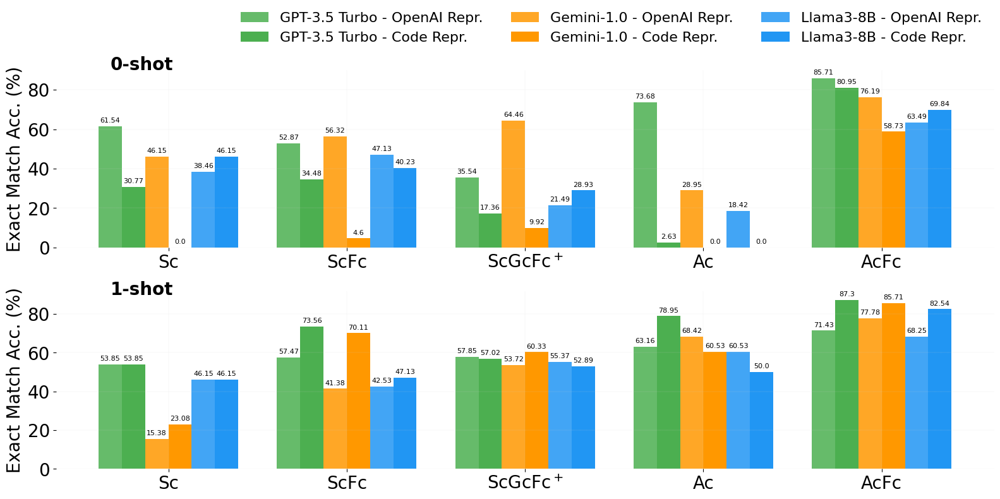
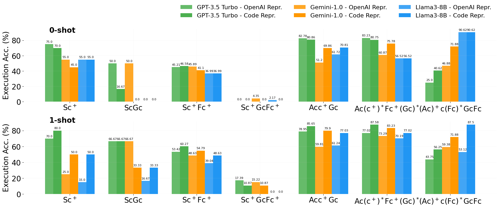
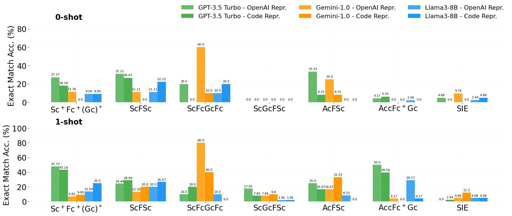
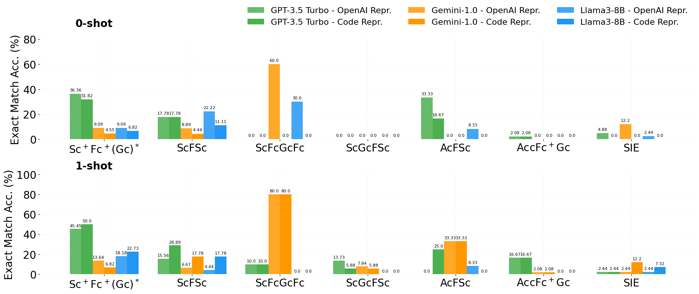
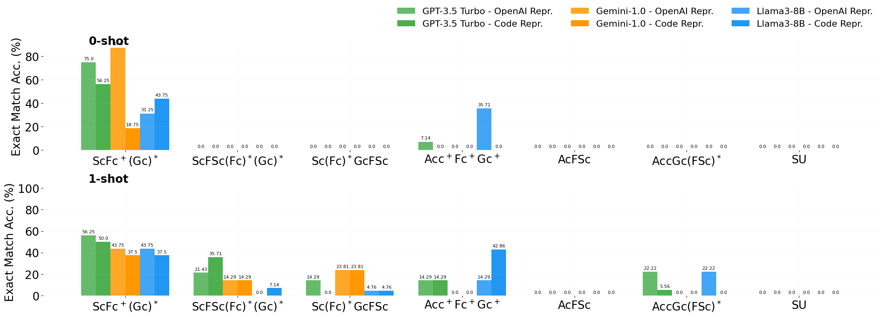
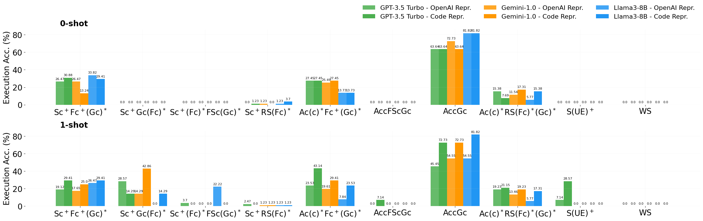

# Applying Text-to-SQL in Process Mining: Leveraging Natural Language for Data Insights

This repository includes the resources referenced in the paper, as well as complementary content. Bellow the details of each resource:

- dataset: 
    - text2sql4pm.tsv: contains all data in tsv format file
    - gold_en.txt: contains the standard SQL statements for English language
    - gold_en.txt: contains the standard SQL statements for Portuguese language 

- results: evaluations of SQL statements generated by the models using OpenAI and Code representations with 0-shot and 1-shot prompt strategies. The results for both languages, English and Portuguese are available in their respective folders. Each strategy used are identified by the folder name and contains the same structure.
    - questions.json: contains the prompts to ask models to generate SQL statements
    - RESULTS_MODEL-gemini-1.0-pro.txt: SQL statements generated by Gemini-1.0 Pro model
    - RESULTS_MODEL-gpg-3.5-turbo.txt: SQL statements generated by GPT-3.5 Turbo model
    - RESULTS_MODEL-Meta-Llama-3-8B-Instruct.txt: SQL statements generated by Llama3-8B Instruct
    - evaluations:
        - scores_cr_gemini10_EM: evaluation results on Exact Match Accuracy metric of SQL statements generated by Gemini-1.0 Pro 
        - scores_cr_gemini10_EX: evaluation results on Execution Accuracy metric of SQL statements generated by Gemini-1.0 Pro 
        - scores_cr_gpt35_EM: evaluation results on Exact Match Accuracy metric of SQL statements generated by GPT-3.5 Turbo 
        - scores_cr_gpt35_EX: evaluation results on Execution Accuracy metric of SQL statements generated by GPT-3.5 Turbo 
        - scores_cr_llama3_EM: evaluation results on Exact Match Accuracy metric of SQL statements generated by Llama3-8B Instruct
        - scores_cr_llama3_EX: evaluation results on Execution Accuracy metric of SQL statements generated by Llama3-8B Instruct

- graphs_results: contains the graphs images for all SQL complexity results for each metric on both languages, Portuguese and English

- scripts:
    - main.py: the entry point for executing the results analysis based on the parameters provided
    - execute_analysis.py: the common pre-steps for executing results analysis for each SQL complexity
    - execution.py: steps and configurations necessary to process the results and generates the graphs for each SQL complexity
    - graphs_plot.py: function to generate the graphs for the paper and complementary content
    - loader_results.py: contains the class used to support the load of files results for each prompt strategy (0-shot and 1-shot) and prompt representation
    - sql_pattern.py: contains filters for SQL patterns template founded in each SQL complexity 
    - utils.py: auxiliary function to calculate results percentage
    - run.sh: shell script to process all results

## Complementary content

This section contains details of each SQL pattern template founded and the complete results of models evaluations using Exact Match Accuracy (EM) and Execution Accuracy (EX) metrics for both languages, English and Portuguese.

### SQL patterns templates and results

### Easy
|  Symbol   |                                           SQL Pattern                                                       |
|-----------|-------------------------------------------------------------------------------------------------------------|
| Sc        | SELECT *concept* FROM event\_log (ORDER BY *concept*+)*                              |
| ScFc      | SELECT *concept* FROM event\_log WHERE (FILTER *concept*) (ORDER BY *concept*+)*      | 
| ScGcFc+| SELECT *concept* FROM event\_log GROUP BY *concept* HAVING (FILTER *concept*)+              |
| Ac        | SELECT AGG(*concept*) FROM event\_log                                                                       |           
| AcFc      | SELECT AGG(*concept*) FROM event\_log (FILTER *concept*)                                                    |

**Exact Match Accuracy**

*English*

*Portuguese*

**Execution Accuracy**

*English*

*Portuguese*

### Medium
|  Symbol   |                                           SQL Pattern                                                       |
|-----------|-------------------------------------------------------------------------------------------------------------|
| Sc+ | SELECT (*concept*+) from event\_log (ORDER BY *concept*)* |
| ScGc  | SELECT *concept* FROM event\_log GROUP BY *concept* ORDER BY *concept* |
| Sc+Fc+   | SELECT (*concept*+) FROM event\_log WHERE (FILTER *concept*)+ (ORDER BY *concept*)* |
| Sc+GcFc+ |  SELECT (*concept*+) FROM event\_log GROUP BY *concept* HAVING (FILTER *concept*)+ |
| Acc+Gc | SELECT AGG(*concept*), (*concept*+) FROM event\_log GROUP BY *concept* |
| Ac(c+)* Fc+(Gc)* | SELECT AGG(*concept*), (*concept*+)*  FROM event\_log WHERE (FILTER *concept*)+(GROUP BY *concept*)* |
| (Ac)+c(Fc)*GcFc | SELECT AGG(*concept*)+, *concept* FROM event\_log (WHERE FILTER *concept*)* GROUP BY *concept* HAVING (FILTER *concept*) |

**Exact Match Accuracy**

*English*

*Portuguese*

**Execution Accuracy**

*English*

*Portuguese*

### Hard
|  Symbol   |                                           SQL Pattern                                                       |
|-----------|-------------------------------------------------------------------------------------------------------------|
|  Sc+Fc+(Gc)* | SELECT (*concept*+) FROM event\_log WHERE (FILTER *concept*)+ (GROUP BY concept)*  (ORDER BY *concept*)* |
|  ScFSc  | SELECT *concept* FROM event\_log WHERE (FILTER *concept* SELECT) |
|  ScFcGcFc  | SELECT *concept* FROM event\_log WHERE (FILTER *concept*) GROUP BY *concept* HAVING (FILTER *concept*) |
|  ScGcFSc  | SELECT *concept* FROM event\_log GROUP BY *concept* HAVING (FILTER *concept* SELECT) |
|  AcFSc  | SELECT AGG(*concept*) FROM event\_log WHERE (FILTER *concept* SELECT) |
|  AccFc+Gc  | SELECT AGG(*concept*), *concept* FROM event\_log WHERE (FILTER *concept*)+ GROUP BY *concept* |
|  SIE | (SELECT) (INTERSECT \| EXCEPT) (SELECT) ((INTERSECT \| EXCEPT) SELECT)* |

**Exact Match Accuracy**

*English*

*Portuguese*

**Execution Accuracy**

*English*

*Portuguese*

### Extra
|  Symbol   |                                           SQL Pattern                                                       |
|-----------|-------------------------------------------------------------------------------------------------------------|
|  ScFc+(Gc)* | SELECT (*concept*) FROM event\_log WHERE (FILTER *concept*)+ (GROUP BY *concept*)*  (ORDER BY *concept*)* |
|  ScFSc(Fc)* (Gc)* | SELECT *concept* FROM event\_log WHERE (FILTER *concept* SELECT) (FILTER *concept*)*  (GROUP BY *concept*)*  (ORDER BY *concept*)* |
|  Sc(Fc)*GcFSc | SELECT *concept* FROM event\_log (WHERE FILTER *concept*)*  GROUP BY *concept* HAVING (FILTER *concept* SELECT) (ORDER BY *concept*)* |
|  Acc+Fc+Gc+ | SELECT AGG(*concept*), *concept*+ FROM event\_log WHERE (FILTER *concept*)+ GROUP BY *concept*+ |
|  AcFSc | SELECT AGG(*concept*) FROM event\_log WHERE (FILTER *concept* SELECT) |
|  AccGc(FSc)* | SELECT AGG(*concept*), *concept* FROM event\_log GROUP BY *concept* (HAVING FILTER *concept* SELECT)*  (ORDER BY *concept*)* |
|  SU | (SELECT) (UNION) (SELECT) |

**Exact Match Accuracy**

*English*

*Portuguese*

**Execution Accuracy**

*English*

*Portuguese*

### No hardness
|  Symbol   |                                           SQL Pattern                                                       |
|-----------|-------------------------------------------------------------------------------------------------------------|
|  Sc+Fc+(Gc)* | SELECT (*concept*+) FROM event\_log (INNER JOIN event\_log)*  WHERE (FILTER *concept*)+ (GROUP BY *concept*)* |
|  Sc+Gc(Fc)* | SELECT (*concept*+) FROM event\_log GROUP BY *concept* (HAVING FILTER *concept*)* |
|  Sc+(Fc)* FSc(Gc)* | SELECT (*concept*+) FROM event\_log WHERE (FILTER *concept*)*  (FILTER *concept* SELECT) (GROUP BY *concept*)* |
|  Sc+RS(Fc)* | SELECT (*concept*+) FROM (event\_log \| SELECT) (JOIN SELECT)*  WHERE (FILTER *concept*)*  (ORDER BY *concept*)* |
|  Ac(c)* Fc+(Gc)* | SELECT AGG(*concept*), (*concept*)*  FROM event\_log (INNER JOIN event\_log)*  WHERE (FILTER *concept*)+ (GROUP BY *concept*)* |
|  AccFScGc | SELECT AGG(*concept*), *concept* FROM event\_log WHERE (FILTER *concept* SELECT) (GROUP BY *concept*) |
|  AccGc | SELECT AGG(*concept*), *concept* FROM event\_log GROUP BY *concept* |
|  Ac(c)* RS(Fc)* (Gc)* | SELECT AGG(*concept*), (*concept*)*  FROM (event\_log \| SELECT) (JOIN SELECT)*  WHERE (FILTER *concept*)*  (GROUP BY *concept*)* |
|  S(UE)+ | SELECT ((UNION\|EXCEPT) SELECT)+ |
|  WS | WITH (SELECT)+ SELECT | 

**Exact Match Accuracy**

*English*

*Portuguese*

**Execution Accuracy**

*English*

*Portuguese*

